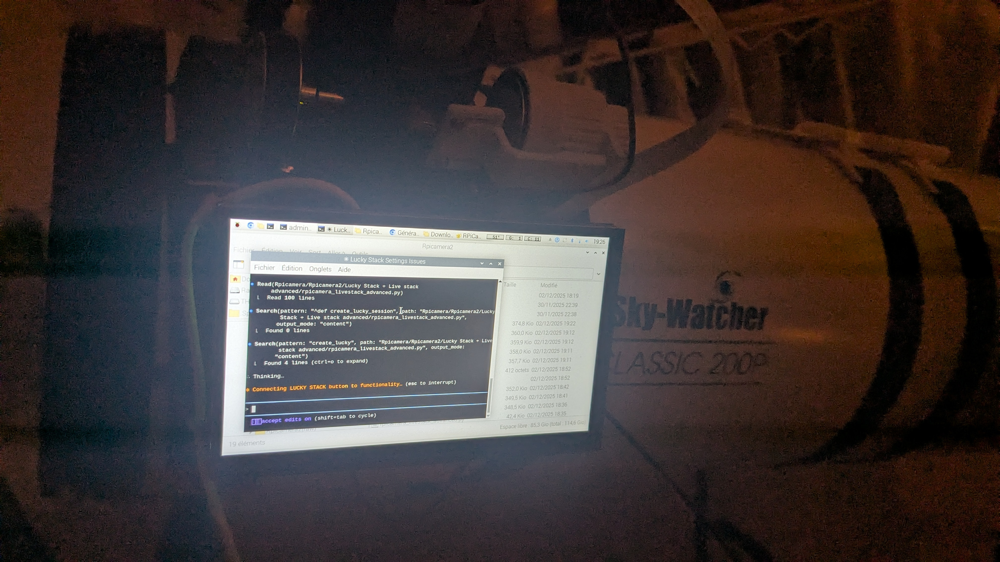

# RPiCamera — Advanced interface for Raspberry Pi cameras (IMX585)

RPiCamera is a control and recording application for Raspberry Pi cameras, optimized for the IMX585 sensor and designed to work with a custom libcamera build (libcamera-imx585). The software provides a Pygame graphical interface, advanced camera parameter control via Picamera2/libcamera, and features useful for astrophotography (focusing assistance, histograms, live stacking support, etc.).

This project is derived from Rpicamera.py developed by: Gordon999 (https://github.com/Gordon999)


---

## Description

RPiCamera provides:
- A Pygame graphical interface for full camera control and live preview (via Picamera2).
- Manual and automatic control of exposure, gain, white balance, gamma, noise reduction, HDR, etc.
- Astrophotography-oriented features: long exposures (several seconds), focusing aids (HFR, FWHM, Laplacian), histograms and SNR metrics.
- Multiple capture modes (RAW/JPG/PNG/RGB/YUV images, videos in H.264/MJPEG/YUV; YUV -> SER export for planetary imaging where supported).
- Network streaming (TCP, UDP, RTSP).
- GPIO support for external triggers and focus buttons.

This release is optimized for the IMX585.

---

## Key features

- Interactive Pygame GUI + Picamera2 preview
- Very long-exposure preview and capture
- Video: H.264, MJPEG, YUV420 (and SER export for planetary use)
- Image capture: RAW, JPG, PNG, RGB, YUV
- Configurable timelapse
- Network streaming: TCP / UDP / RTSP
- Real-time analysis: histograms (RGB / luminance), HFR / FWHM for focus assistance, Laplacian-based SNR
- Advanced controls: custom white balance, exposure/gain, gamma, noise reduction, HDR modes
- GPIO support (gpiozero) for external buttons
- Integration with Astro Live Stacker (ALS) for live stacking workflows

---

## Requirements

Recommended OS: Raspberry Pi OS (Bullseye or Bookworm), fully updated. Package names and availability may differ across distributions.

Note: For IMX585 support you must follow the instructions in the custom libcamera repository: https://github.com/will12753/libcamera-imx585

### System packages (APT)

Run:
```bash
sudo apt update
sudo apt install -y \
  python3 python3-pip python3-venv git ffmpeg \
  libatlas-base-dev libopenjp2-7 libtiff5-dev libjpeg-dev libpng-dev \
  libv4l-dev v4l-utils libcamera-dev libcamera-apps \
  gstreamer1.0-tools gstreamer1.0-plugins-base gstreamer1.0-plugins-good \
  gstreamer1.0-plugins-bad
```

Notes:
- `libcamera-dev` and `libcamera-apps` are required for Picamera2 and libcamera-based workflows.
- `ffmpeg` is useful for video encoding and post-processing.
- GStreamer plugins may be required for RTSP and advanced streaming setups.
- On Raspberry Pi it is often faster and more reliable to install heavy Python packages via apt (for example `python3-astropy`, `python3-scipy`, `python3-opencv`) to avoid long pip compilations.

### Python dependencies (pip)

Use a virtual environment:
```bash
python3 -m venv ~/rpicam-venv
source ~/rpicam-venv/bin/activate
pip install --upgrade pip
```

Minimal Python dependencies:
- pygame
- numpy
- matplotlib
- picamera2
- gpiozero
- pillow

Additional dependencies:
- astropy (used: astropy.stats.sigma_clipped_stats)
- scipy (used: scipy.ndimage)
- scikit-image (used: skimage.feature.peak_local_max)
- opencv-python (cv2), used by several scripts for image processing

Recommended pip install command:
```bash
pip install pygame numpy matplotlib picamera2 gpiozero pillow \
            astropy scipy scikit-image opencv-python
```

APT alternatives on Raspberry Pi OS:
```bash
sudo apt install -y python3-astropy python3-scipy python3-opencv python3-skimage
```

---

## Quick installation

1. Clone the repository:
```bash
git clone https://github.com/remis-astr/Rpicamera.git
cd Rpicamera
```

2. Prepare the Python environment:
```bash
python3 -m venv .venv
source .venv/bin/activate
pip install --upgrade pip
# install dependencies (see Requirements section)
pip install -r requirements.txt  # if a requirements file is present
```

3. Install or prepare the IMX585 driver (if applicable):
- Follow the instructions in `will12753/libcamera-imx585` to build and install the driver and configuration files.

4. Run the application (replace with actual entry script if different):
```bash
python RPiCamera2.py
```

---

## File structure and recommended configuration

- Photos: `~/Pictures/` (for large RAWs, prefer an external USB drive)
  - Example: pic_dir = "/media/admin/USBdrive/Pictures"
- Videos: `~/Videos/`
- User configuration file: `~/PiLCConfig104.txt`
- Sensor tuning file: `~/imx585_lowlight.json` (IMX585 low-light settings)

---

## Sensor tuning (IMX585)

To take full advantage of the IMX585:
- Use provided or customized JSON tuning files (for example `imx585_lowlight.json`).
- Experiment with exposure/gain, HDR and noise reduction settings.
- See the `will12753/libcamera-imx585` repo for build instructions and examples.

---

## Live stacking (Astro Live Stacker)

RPiCamera can produce image sequences (timelapse or continuous captures) compatible with Astro Live Stacker (ALS). To use ALS:
- Configure ALS to monitor the folder where RPiCamera writes images (prefer a USB drive for performance).
- Use TIMELAPSE or continuous capture modes depending on your workflow.

---

## Astrophotography / SER format

- SER is commonly used for planetary imaging. The project provides YUV->SER export for certain capture modes and resolutions where applicable.
- 87 FPS acquisition mode is available in zoom/ROI mode. Use fast storage (SD/USB/SSD) to avoid dropped frames.

---

## Contributing

Contributions are welcome:
- Open issues and PRs for bugs and new features.
- Add support for additional sensors.
- Help implementing RAW video -> SER export.
- Improvements: auto-stretch / quality preview.
- Native live stacking surface/planet integration.
- Advanced timelapse features (ALLSKY video).

---

## License

This project includes the original copyright header from Gordon999. Check the `LICENSE` file for full terms. The software is provided "AS IS" without warranty.

---

## Useful links

- Original: https://github.com/Gordon999
- Custom libcamera IMX585: https://github.com/will12753/libcamera-imx585
- IMX585 sensor: https://soho-enterprise.com/
- Astro Live Stacker: https://als-app.org/
- Picamera2 / Raspberry Pi documentation: https://www.raspberrypi.com/documentation/

- ---------------------------------------------------------------------------

I don't own a smart telescope, but I caught mine thinking about what it wanted to be. I managed to take a picture of it doing just that.



This little guy is amazing; the only limit is my imagination.
