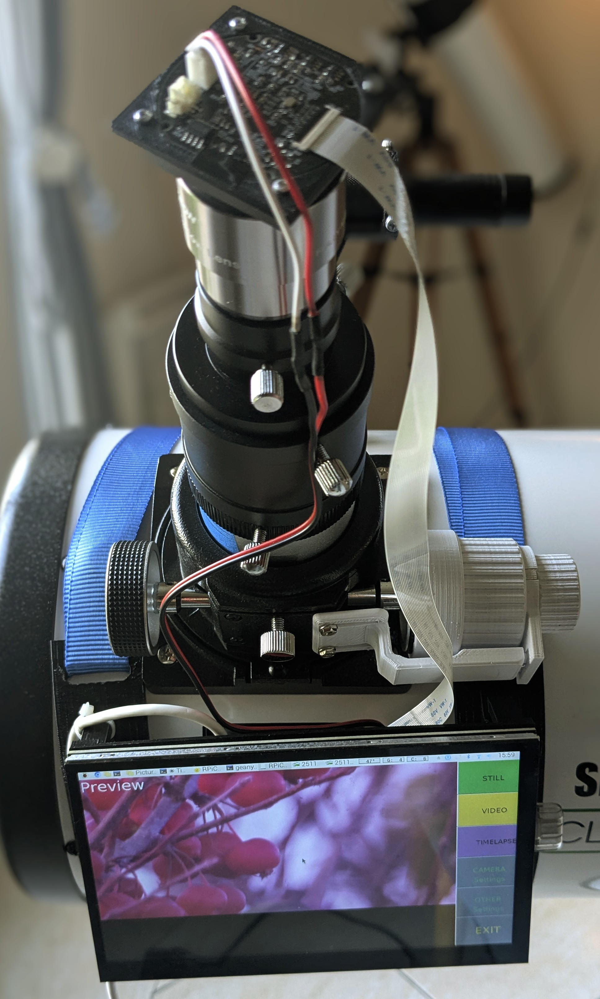
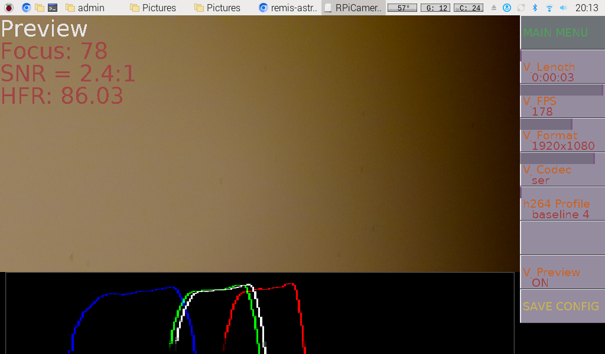
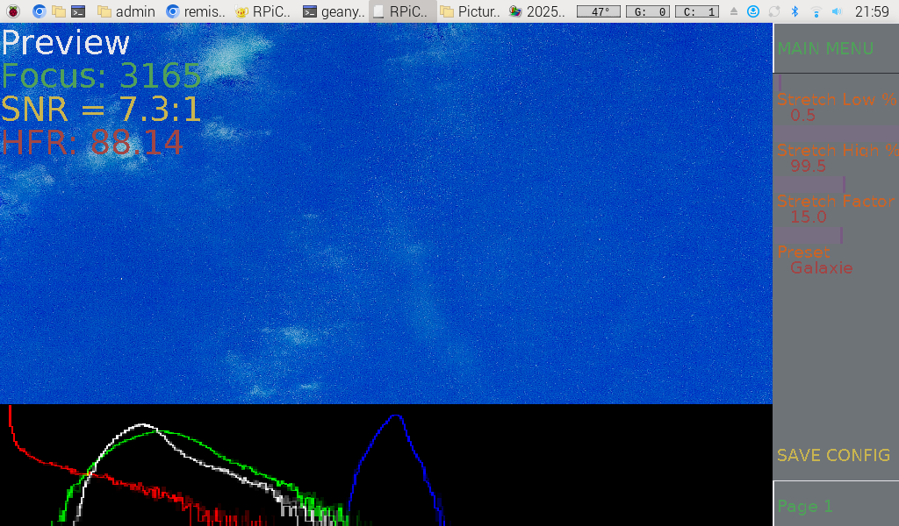
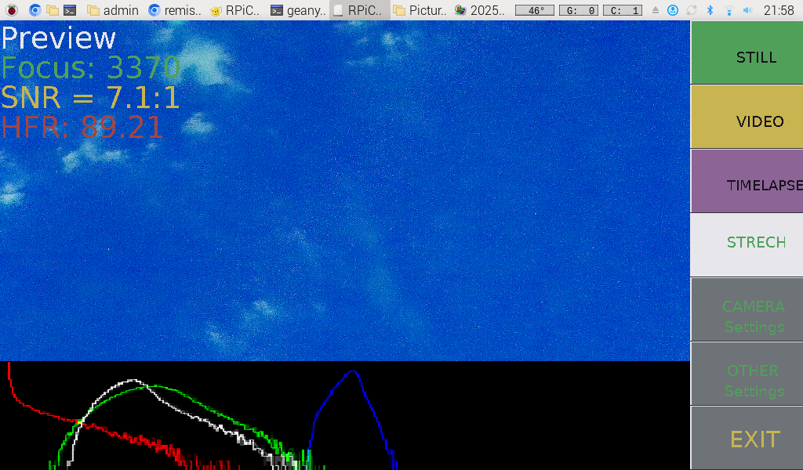
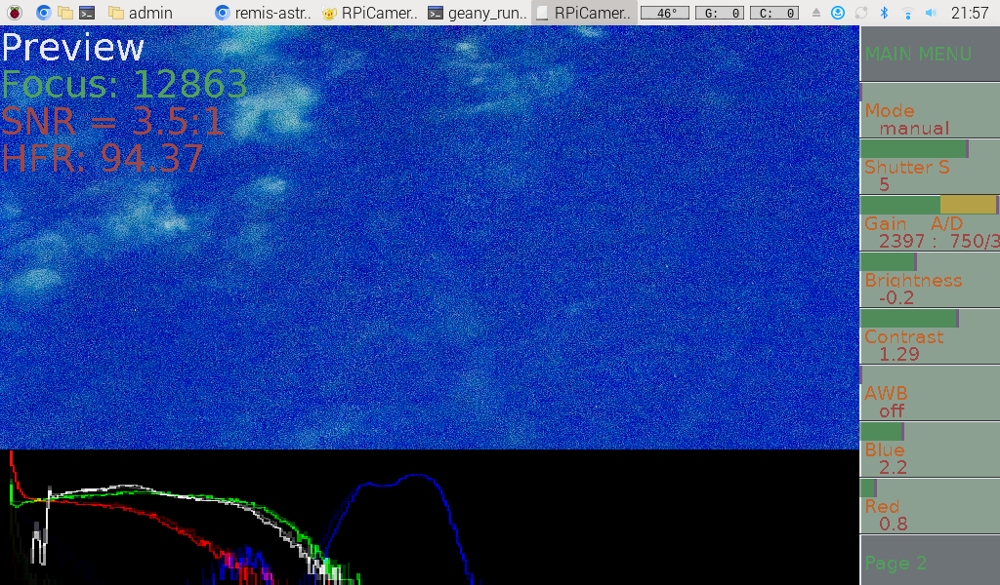

# Rpicamera
Raspberry Pi camera interface for IMX585

# RPiCamera - Advanced control interface for Raspberry Pi cameras

This program is derived from Rpicamera.py developed by: [Gordon999](https://github.com/Gordon999)







## Description

RPiCamera is a comprehensive control and recording application for Raspberry Pi cameras, developed with a Pygame graphical interface. The program offers advanced camera parameter control, optimized for astrophotography with the IMX585 sensor.
This version is optimized for the IMX585 sensor and works with the custom libcamera developed by [will12753](https://github.com/will12753/libcamera-imx585), it may not be optimal with a standard Libcamera version working with other IMX sensors...

### Main features

- **Interactive graphical interface**: Complete control via Pygame interface and preview managed by Picamera2.
- Preview operation up to 7 seconds exposure.
- **Multiple recording modes**:
  - Video recording (H.264, MJPEG, YUV420 and YUV420 ->SER for planetary imaging)
  - Ability to capture SER video at 87 FPS by activating the zoom function (different ROI resolutions available).
  - Image capture (RAW, JPG, PNG, RGB, YUV)
  - Configurable time-lapse
- **Video streaming**: TCP, UDP and RTSP support
- **Real-time analysis**:
  - Histograms (RGB and luminance)
  - Focus function: HFR (Half-Flux Radius) and FWHM calculation for astrophotography focusing assistance
  - In focus mode and zoom mode: focus value display (Laplacian of Variance) and SNR calculation
- **Advanced controls**:
  - Customizable white balance
  - Exposure and gain control
  - Gamma correction and noise reduction
  - HDR modes: single / auto / sensor
- **GPIO support**: External buttons for focus and trigger
- ...

## Dependencies

### Python libraries

Install Python dependencies with pip:
```bash
pip3 install pygame opencv-python numpy matplotlib picamera2 gpiozero
```

Library details:

- **pygame**: Graphical interface and event management
- **opencv-python (cv2)**: Image processing and analysis
- **numpy**: Numerical calculations and array manipulation
- **matplotlib**: Graph generation (histograms)
- **picamera2**: Modern interface for Raspberry Pi cameras
- **libcamera**: Camera control library (see custom libcamera section below)
- **gpiozero**: GPIO control for external buttons

### System tools

Install necessary system tools:
```bash
sudo apt-get install -y ffmpeg
```

- **ffmpeg**: Video conversion and post-processing

### Additional system libraries
```bash
sudo apt-get install -y libcamera-dev libcamera-apps
```

### File structure

- **Photos**: Saved in `~/Pictures/` -> I recommend storing RAW files directly on USB drives: - pic_dir = "/media/admin/..."
- **Videos**: Saved in `~/Videos/` -> keep videos on internal memory for better speed
- **Configuration**: `~/PiLCConfig104.txt`

### Camera tuning files

You can use custom tuning files:

- `~/imx585_lowlight.json`: Configuration for IMX585 in low-light mode

## Live stacking ALS (Astro Live Stacker)

Live stacking can be used by combining this program with ALS (Astro Live Stacker)
ALS allows real-time image stacking to reveal faint celestial objects, in combination with video streams generated by RPiCamera.
Configure ALS to read the directory of images recorded by the application in TIMELAPSE mode (ideally on USB drive).

## Contributions

**All contributions are welcome!**

The development of this program is open to the community. Feel free to:

- Propose new features
- Fix bugs
- Add support for new sensors
- Find a solution to implement RAW video mode -> SER (not found yet need help)
- Develop auto-stretch for preview -> done
- Develop native live stacking integration -> done
- Timelapse like ALLSKKY

## License

Copyright (c) 2025 Gordon999

Permission is hereby granted, free of charge, to any person obtaining a copy of this software and associated documentation files (the "Software"), to deal in the Software without restriction, including without limitation the rights to use, copy, modify, merge, publish, distribute, sublicense, and/or sell copies of the Software, and to permit persons to whom the Software is furnished to do so, subject to the following conditions:

The above copyright notice and this permission notice shall be included in all copies or substantial portions of the Software.

THE SOFTWARE IS PROVIDED "AS IS", WITHOUT WARRANTY OF ANY KIND, EXPRESS OR IMPLIED, INCLUDING BUT NOT LIMITED TO THE WARRANTIES OF MERCHANTABILITY, FITNESS FOR A PARTICULAR PURPOSE AND NONINFRINGEMENT. IN NO EVENT SHALL THE AUTHORS OR COPYRIGHT HOLDERS BE LIABLE FOR ANY CLAIM, DAMAGES OR OTHER LIABILITY, WHETHER IN AN ACTION OF CONTRACT, TORT OR OTHERWISE, ARISING FROM, OUT OF OR IN CONNECTION WITH THE SOFTWARE OR THE USE OR OTHER DEALINGS IN THE SOFTWARE.

## Useful resources and links

- **Original program**: [Gordon999](https://github.com/Gordon999)
- **Custom libcamera IMX585**: [will12753/libcamera-imx585](https://github.com/will12753/libcamera-imx585)
- **IMX585 sensor**: [SOHO Enterprise](https://soho-enterprise.com/)
- **Live Stacking (ALS)**: [Astro Live Stacker](https://als-app.org/fr/)
-  **7inch touch screen**: https://www.lcdwiki.com/7inch_HDMI_Display-H


